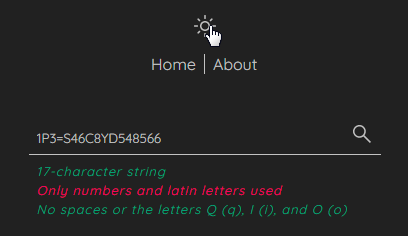
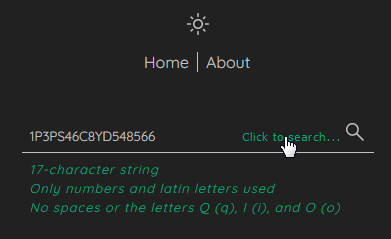
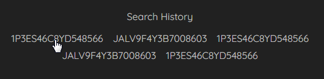
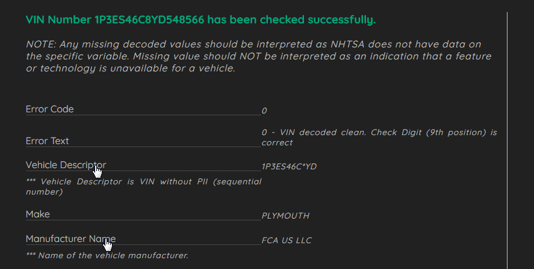
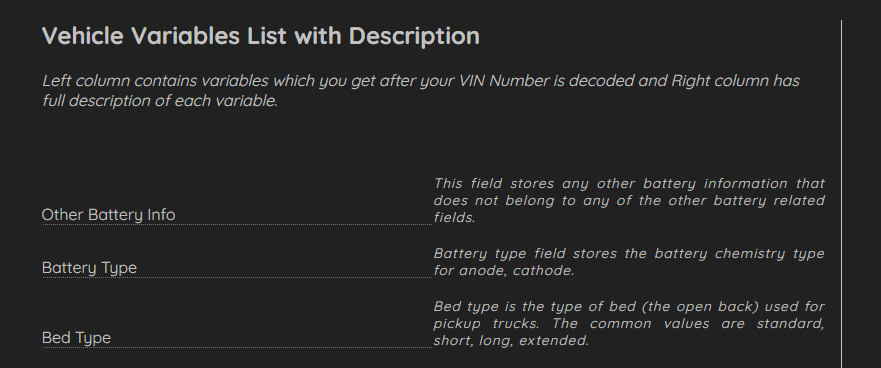

#  VIN Number Decoder

This application is a universal VIN decoder. Every car has a unique identifier code called a VIN. This number contains vital information about the car, such as its manufacturer, year of production, the plant it was produced in, type of engine, model and more. For instance, if someone wants to buy a car, it is possible to check the VIN number on the online database to ensure that the car was not stolen, damaged or illegally modified. The VIN number has a specific format that is globally recognized. This format was implemented by the ISO institute. Every car manufacturer is obliged to mark all its vehicles in this special format. This online service allows a user to check the validity of the car and get detailed information on almost any VIN number, search car parts and check the car's history.

##  How to use
Enter your vehicle's 17-character Vehicle Identification Number (VIN) in the field above to look up and receive an instant report on its manufacturer, brand, make and model, body style, engine size, assembly plant, and model year. The information is provided by the [National Highway Traffic Safety Administration](https://www.nhtsa.gov/) (NHTSA) from the data submitted by the manufacturers to NHTSA. The VIN Decoder lookup is intended for use with vehicles manufactured since 1981. If your vehicle was made before 1981, the VIN will most likely contain 11 characters.

##  Application features
- With the help of navigation bar you can surf through Home and About pages as well as change color mode from dark to light. Search bar provides three leves of client side validation with color signals to indicate successful passing.

- Search button appears only if all three conditions of validation are met.

- There is search history with the five last searches which are stored inside local storage of the browser. 

- Upon successful fetching of data there is a list with VIN number decoded data. Each vaiable of the list can be expanded on click to show description what this variable does mean. If the fetch is broken there will be corresponding message that something went wrong.

- About page contains additional information about VIN number as well as fetched data with full list of all possible decoded variables with it description.

##  Links
Try it now! [VIN Number Decoder ](https://vvv-sss.github.io/vin_decoder/)

##  Built with

- React JS
- Javascript, AJAX
- HTML5
- CSS

##  Author

- Volodymyr Serbulenko
- E-mail: serbulenko1volodymyr@gmail.com